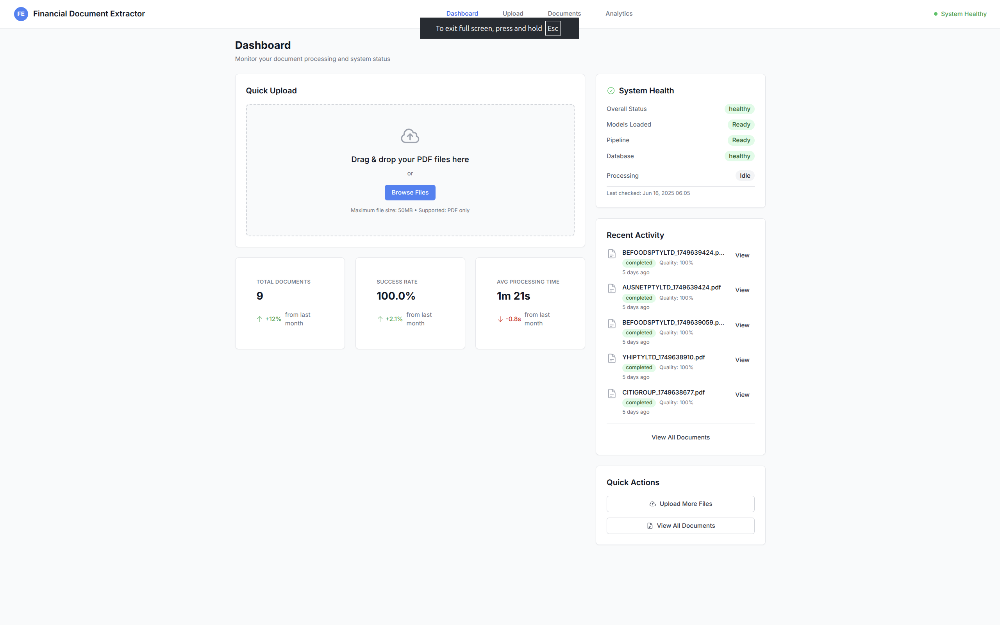
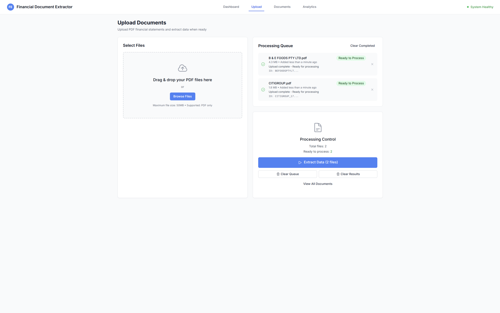
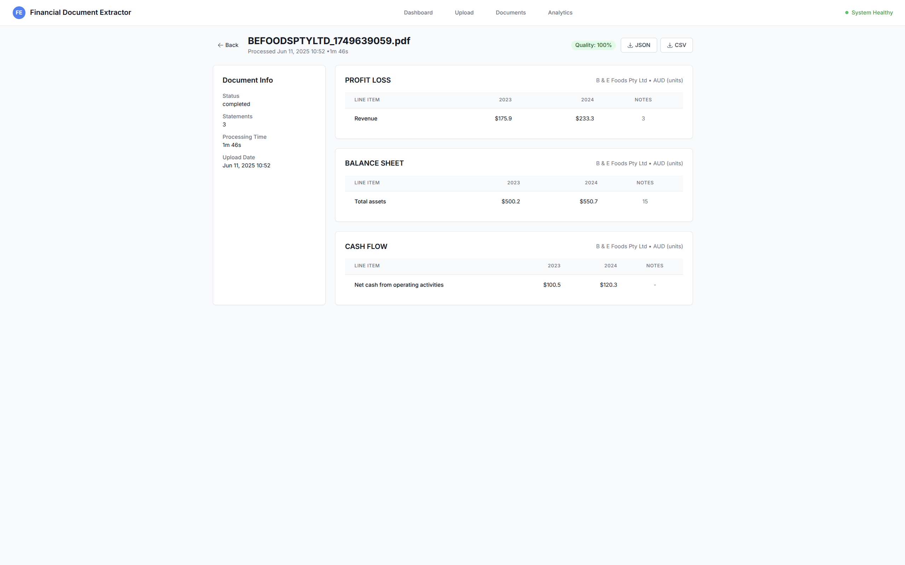
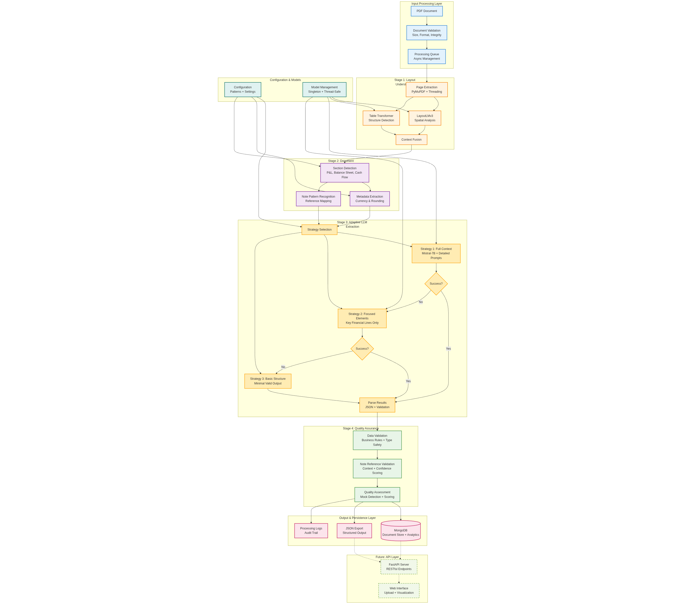
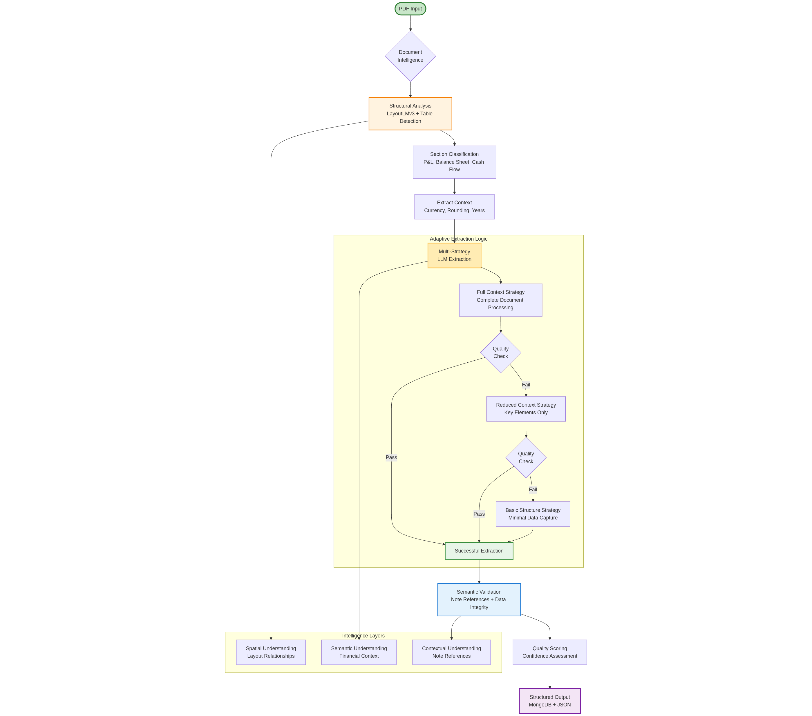
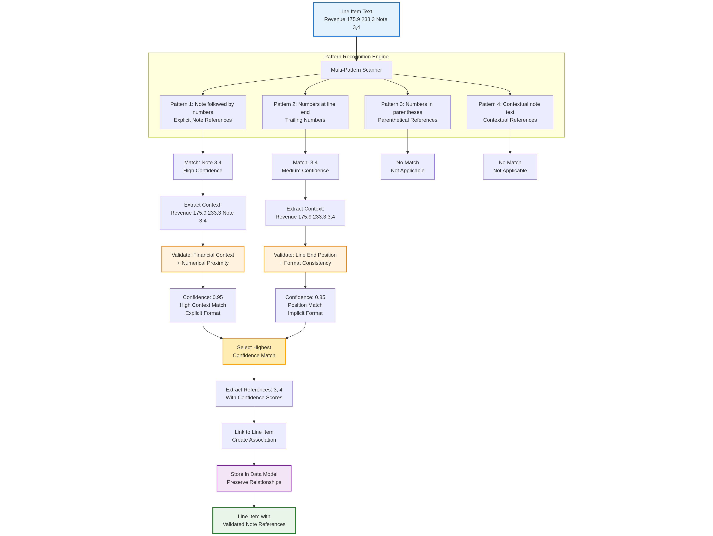

# 📊 Financial Document Extractor

A sophisticated AI-powered financial document processing system that extracts data from annual reports and financial statements while preserving critical semantic relationships between financial line items and their explanatory notes.

<div align="center">

[](https://opensource.org/licenses/MIT)
[](https://www.python.org/downloads/)
[](https://reactjs.org/)
[](https://www.typescriptlang.org/)
[](https://fastapi.tiangolo.com/)

</div>

## 📋 Description

The Financial Document Extractor is a comprehensive solution designed to automate the extraction of financial data from PDF documents. This system combines advanced computer vision, natural language processing, and machine learning techniques to deliver highly accurate financial data extraction while maintaining the integrity of note references and contextual relationships.

### 💡 **Why it exists:**
Traditional OCR and basic NLP solutions fail to preserve the critical semantic relationships between financial line items and their explanatory notes. This system addresses that gap by implementing a multi-strategy extraction approach that maintains note reference integrity while delivering high-accuracy financial data extraction.

## ✨ Features

### 🖥️ Backend Processing Engine
- 🧠 **Multi-Strategy LLM Extraction**: Adaptive fallback mechanisms with three-tier processing strategy
- 📐 **Layout-Aware Document Understanding**: LayoutLMv3 + Table Transformer for spatial context preservation
- 🔗 **Note Reference Intelligence**: Comprehensive pattern matching and validation system
- 💰 **Financial Metadata Detection**: Currency and rounding scale intelligence
- ✅ **Quality Assurance Framework**: Multi-level validation with confidence scoring
- ⚡ **Real-time Processing Status**: WebSocket-based status monitoring
- 📦 **Batch Processing**: Efficient multi-document processing capabilities

### 🎨 Frontend Interface
- 📤 **Drag & Drop Upload**: Intuitive file upload with real-time progress tracking
- 📊 **Interactive Dashboard**: System health monitoring and key metrics display
- 📁 **Document Management**: Grid/list views with search and filtering capabilities
- 📈 **Results Visualization**: Financial statement viewer with quality indicators
- 📉 **Analytics Dashboard**: Processing trends and quality distribution charts
- 💾 **Export Functionality**: Multiple format support (JSON, CSV)
- 🔄 **Real-time Updates**: Live status polling and notifications

### ⚙️ Technical Capabilities
- 🔒 **Offline Processing**: Complete local operation without external dependencies
- 📏 **Scalable Architecture**: Horizontal scaling with intelligent parallelization
- 🛠️ **Error Recovery**: Robust error handling with retry mechanisms
- ✔️ **Data Validation**: Semantic validation and business rule compliance
- 📊 **Performance Monitoring**: Comprehensive metrics and logging

## 🚀 Installation

### 📋 Prerequisites
- 🐍 **Python**: 3.9 or higher
- 🟢 **Node.js**: 16.0 or higher
- 🗄️ **MongoDB**: 5.0 or higher
- 💾 **System RAM**: 8-16GB (for model loading)
- 💿 **Storage**: 10GB+ free space (for models and data)

### 🖥️ Backend Setup

1. **📥 Clone the repository:**
```bash
git clone https://github.com/LasaK97/End-to-End-Multi-Stage-Intelligent-Financial-Data-Extraction-System.git
cd End-to-End-Multi-Stage-Intelligent-Financial-Data-Extraction-System/backend
```

2. **🔧 Create and activate virtual environment:**
```bash
python -m venv venv
source venv/bin/activate  # On Windows: venv\Scripts\activate
```

3. **📦 Install Python dependencies:**
```bash
pip install -r requirements.txt
```

4. **⬇️ Download required models:**
```bash
python scripts/download_models.py
```

5. **⚙️ Set up environment variables:**
```bash
cp .env.example .env
# Edit .env with following configurations (see Backend Configuration section below)
```

6. **🚀 Start the backend server:**
```bash
python -m uvicorn src.api:app --reload --host 0.0.0.0 --port 8000
```

### 🎨 Frontend Setup

1. **📂 Navigate to frontend directory:**
```bash
cd ../frontend
```

2. **📦 Install Node.js dependencies:**
```bash
npm install
```

3. **⚙️ Set up environment variables:**
```bash
cp .env.local.example .env.local
# Edit .env.local with following configuration (see Frontend Configuration section below)
```

4. **🚀 Start the development server:**
```bash
npm run dev
```

### 🌐 Access Points

The application will be available at:

<div align="center">

| Service | URL | Description |
|---------|-----|-------------|
| 🎨 **Frontend** | http://localhost:5173 | Main user interface |
| 🔧 **Backend API** | http://localhost:8000 | REST API endpoints |
| 📚 **API Docs** | http://localhost:8000/docs | Interactive API documentation |

</div>

## 🎯 Usage

### 🚀 Quick Start

1. **📤 Upload Documents**
   - Navigate to the Upload page
   - Drag and drop PDF financial documents or click to browse
   - Wait for upload confirmation

2. **⚙️ Process Documents**
   - Click "Extract Data" to start batch processing
   - Monitor real-time progress in the processing queue
   - View completion status and any error messages

3. **📊 View Results**
   - Navigate to Documents page to see processed files
   - Click "View Results" to see extracted financial data
   - Use the export menu to download results in various formats

## ⚙️ Configuration

### 🔧 Environment Variables

#### 🖥️ Backend (.env)
```bash
# 🗄️ Database Configuration
MONGODB_URL=mongodb://localhost:27017/findoc_extractor
MONGODB_DB_NAME=findoc_extractor

# 🤖 Model Configuration
MODELS_PATH=./models
CACHE_SIZE=1000

# ⚙️ Processing Configuration
MAX_FILE_SIZE_MB=50
BATCH_SIZE=5
WORKER_THREADS=4

# 🌐 API Configuration
API_HOST=0.0.0.0
API_PORT=8000
CORS_ORIGINS=["http://localhost:3000"]

# 📝 Logging
LOG_LEVEL=INFO
LOG_FILE=./logs/app.log
```

#### 🎨 Frontend (.env.local)
```bash
# 🌐 API Configuration
VITE_API_BASE_URL=http://localhost:8000
VITE_WS_URL=ws://localhost:8000/ws

# ⚙️ Application Configuration
VITE_ENVIRONMENT=development
VITE_MAX_FILE_SIZE_MB=50# 📊 Financial Document Extractor

A sophisticated AI-powered financial document processing system that extracts data from annual reports and financial statements while preserving critical semantic relationships between financial line items and their explanatory notes.

<div align="center">

[](https://opensource.org/licenses/MIT)
[](https://www.python.org/downloads/)
[](https://reactjs.org/)
[](https://www.typescriptlang.org/)
[](https://fastapi.tiangolo.com/)

</div>

## 📋 Description

The Financial Document Extractor is a comprehensive solution designed to automate the extraction of financial data from PDF documents. This system combines advanced computer vision, natural language processing, and machine learning techniques to deliver highly accurate financial data extraction while maintaining the integrity of note references and contextual relationships.

### 💡 **Why it exists:**
Traditional OCR and basic NLP solutions fail to preserve the critical semantic relationships between financial line items and their explanatory notes. This system addresses that gap by implementing a multi-strategy extraction approach that maintains note reference integrity while delivering high-accuracy financial data extraction.

## ✨ Features

### 🖥️ Backend Processing Engine
- 🧠 **Multi-Strategy LLM Extraction**: Adaptive fallback mechanisms with three-tier processing strategy
- 📐 **Layout-Aware Document Understanding**: LayoutLMv3 + Table Transformer for spatial context preservation
- 🔗 **Note Reference Intelligence**: Comprehensive pattern matching and validation system
- 💰 **Financial Metadata Detection**: Currency and rounding scale intelligence
- ✅ **Quality Assurance Framework**: Multi-level validation with confidence scoring
- ⚡ **Real-time Processing Status**: WebSocket-based status monitoring
- 📦 **Batch Processing**: Efficient multi-document processing capabilities

### 🎨 Frontend Interface
- 📤 **Drag & Drop Upload**: Intuitive file upload with real-time progress tracking
- 📊 **Interactive Dashboard**: System health monitoring and key metrics display
- 📁 **Document Management**: Grid/list views with search and filtering capabilities
- 📈 **Results Visualization**: Financial statement viewer with quality indicators
- 📉 **Analytics Dashboard**: Processing trends and quality distribution charts
- 💾 **Export Functionality**: Multiple format support (JSON, CSV)
- 🔄 **Real-time Updates**: Live status polling and notifications

### ⚙️ Technical Capabilities
- 🔒 **Offline Processing**: Complete local operation without external dependencies
- 📏 **Scalable Architecture**: Horizontal scaling with intelligent parallelization
- 🛠️ **Error Recovery**: Robust error handling with retry mechanisms
- ✔️ **Data Validation**: Semantic validation and business rule compliance
- 📊 **Performance Monitoring**: Comprehensive metrics and logging

## 🚀 Installation

### 📋 Prerequisites
- 🐍 **Python**: 3.9 or higher
- 🟢 **Node.js**: 16.0 or higher
- 🗄️ **MongoDB**: 5.0 or higher
- 💾 **System RAM**: 8-16GB (for model loading)
- 💿 **Storage**: 10GB+ free space (for models and data)

### 🖥️ Backend Setup

1. **📥 Clone the repository:**
```bash
git clone https://github.com/LasaK97/End-to-End-Multi-Stage-Intelligent-Financial-Data-Extraction-System.git
cd End-to-End-Multi-Stage-Intelligent-Financial-Data-Extraction-System/backend
```

2. **🔧 Create and activate virtual environment:**
```bash
python -m venv venv
source venv/bin/activate  # On Windows: venv\Scripts\activate
```

3. **📦 Install Python dependencies:**
```bash
pip install -r requirements.txt
```

4. **⬇️ Download required models:**
```bash
python scripts/download_models.py
```

5. **⚙️ Set up environment variables:**
```bash
cp .env.example .env
# Edit .env with following configurations (see Backend Configuration section below)
```

6. **🚀 Start the backend server:**
```bash
python -m uvicorn src.api:app --reload --host 0.0.0.0 --port 8000
```

### 🎨 Frontend Setup

1. **📂 Navigate to frontend directory:**
```bash
cd ../frontend
```

2. **📦 Install Node.js dependencies:**
```bash
npm install
```

3. **⚙️ Set up environment variables:**
```bash
cp .env.local.example .env.local
# Edit .env.local with following configuration (see Frontend Configuration section below)
```

4. **🚀 Start the development server:**
```bash
npm run dev
```

### 🌐 Access Points

The application will be available at:

<div align="center">

| Service | URL | Description |
|---------|-----|-------------|
| 🎨 **Frontend** | http://localhost:5173 | Main user interface |
| 🔧 **Backend API** | http://localhost:8000 | REST API endpoints |
| 📚 **API Docs** | http://localhost:8000/docs | Interactive API documentation |

</div>

## 🎯 Usage

### 🚀 Quick Start

1. **📤 Upload Documents**
   - Navigate to the Upload page
   - Drag and drop PDF financial documents or click to browse
   - Wait for upload confirmation

2. **⚙️ Process Documents**
   - Click "Extract Data" to start batch processing
   - Monitor real-time progress in the processing queue
   - View completion status and any error messages

3. **📊 View Results**
   - Navigate to Documents page to see processed files
   - Click "View Results" to see extracted financial data
   - Use the export menu to download results in various formats

## ⚙️ Configuration

### 🔧 Environment Variables

#### 🖥️ Backend (.env)
```bash
# 🗄️ Database Configuration
MONGODB_URL=mongodb://localhost:27017/findoc_extractor
MONGODB_DB_NAME=findoc_extractor

# 🤖 Model Configuration
MODELS_PATH=./models
CACHE_SIZE=1000

# ⚙️ Processing Configuration
MAX_FILE_SIZE_MB=50
BATCH_SIZE=5
WORKER_THREADS=4

# 🌐 API Configuration
API_HOST=0.0.0.0
API_PORT=8000
CORS_ORIGINS=["http://localhost:3000"]

# 📝 Logging
LOG_LEVEL=INFO
LOG_FILE=./logs/app.log
```

#### 🎨 Frontend (.env.local)
```bash
# 🌐 API Configuration
VITE_API_BASE_URL=http://localhost:8000
VITE_WS_URL=ws://localhost:8000/ws

# ⚙️ Application Configuration
VITE_ENVIRONMENT=development
VITE_MAX_FILE_SIZE_MB=50

# 🚀 Feature Flags
VITE_ENABLE_ANALYTICS=true
VITE_ENABLE_EXPORT=true
```

### 🤖 Model Configuration

The system requires several pre-trained models that are automatically downloaded:
- 📐 **LayoutLMv3**: For document layout understanding
- 📊 **Table Transformer**: For table detection and structure recognition
- 🧠 **Mistral-7B-Instruct**: For intelligent text extraction

Model storage and configuration can be customized in `src/config.py`.

## 🐛 Reporting Issues

Please use the GitHub issue tracker to report bugs or request features. Include:
- 📝 Detailed description of the issue
- 🔄 Steps to reproduce
- ✅ Expected vs actual behavior
- 💻 Environment details (OS, Python version, etc.)

## 📄 License

This project is licensed under the MIT License - see the [LICENSE](LICENSE) file for details.

## 📞 Contact / Support

- **Project Maintainer**: [Lasantha Kulasooriya](mailto:ls97kulasooriya@gmail.com)
- **Issues**: Use GitHub Issues for bug reports and feature requests

## 📸 Screenshots / Demo

### Dashboard Overview

*Main dashboard showing system health, processing statistics, and recent activity*

### Document Upload Interface

*Drag-and-drop file upload with real-time progress tracking*

### Results Visualization

*Financial statement viewer with extracted data and quality indicators*

## 🏗️ Architecture Overview

The system follows a modern microservices architecture with intelligent data processing pipelines:

### 🔄 Data Flow Architecture

*Complete data flow showing the multi-stage processing pipeline from document upload to structured output*

### 🧠 Extraction Strategy Framework

*Multi-strategy adaptive extraction approach with progressive fallback mechanisms*

### 🔗 Note Reference Intelligence
# 📊 Financial Document Extractor

A sophisticated AI-powered financial document processing system that extracts data from annual reports and financial statements while preserving critical semantic relationships between financial line items and their explanatory notes.

<div align="center">

[](https://opensource.org/licenses/MIT)
[](https://www.python.org/downloads/)
[](https://reactjs.org/)
[](https://www.typescriptlang.org/)
[](https://fastapi.tiangolo.com/)

</div>

## 📋 Description

The Financial Document Extractor is a comprehensive solution designed to automate the extraction of financial data from PDF documents. This system combines advanced computer vision, natural language processing, and machine learning techniques to deliver highly accurate financial data extraction while maintaining the integrity of note references and contextual relationships.

### 💡 **Why it exists:**
Traditional OCR and basic NLP solutions fail to preserve the critical semantic relationships between financial line items and their explanatory notes. This system addresses that gap by implementing a multi-strategy extraction approach that maintains note reference integrity while delivering high-accuracy financial data extraction.

## ✨ Features

### 🖥️ Backend Processing Engine
- 🧠 **Multi-Strategy LLM Extraction**: Adaptive fallback mechanisms with three-tier processing strategy
- 📐 **Layout-Aware Document Understanding**: LayoutLMv3 + Table Transformer for spatial context preservation
- 🔗 **Note Reference Intelligence**: Comprehensive pattern matching and validation system
- 💰 **Financial Metadata Detection**: Currency and rounding scale intelligence
- ✅ **Quality Assurance Framework**: Multi-level validation with confidence scoring
- ⚡ **Real-time Processing Status**: WebSocket-based status monitoring
- 📦 **Batch Processing**: Efficient multi-document processing capabilities

### 🎨 Frontend Interface
- 📤 **Drag & Drop Upload**: Intuitive file upload with real-time progress tracking
- 📊 **Interactive Dashboard**: System health monitoring and key metrics display
- 📁 **Document Management**: Grid/list views with search and filtering capabilities
- 📈 **Results Visualization**: Financial statement viewer with quality indicators
- 📉 **Analytics Dashboard**: Processing trends and quality distribution charts
- 💾 **Export Functionality**: Multiple format support (JSON, CSV)
- 🔄 **Real-time Updates**: Live status polling and notifications

### ⚙️ Technical Capabilities
- 🔒 **Offline Processing**: Complete local operation without external dependencies
- 📏 **Scalable Architecture**: Horizontal scaling with intelligent parallelization
- 🛠️ **Error Recovery**: Robust error handling with retry mechanisms
- ✔️ **Data Validation**: Semantic validation and business rule compliance
- 📊 **Performance Monitoring**: Comprehensive metrics and logging

## 🚀 Installation

### 📋 Prerequisites
- 🐍 **Python**: 3.9 or higher
- 🟢 **Node.js**: 16.0 or higher
- 🗄️ **MongoDB**: 5.0 or higher
- 💾 **System RAM**: 8-16GB (for model loading)
- 💿 **Storage**: 10GB+ free space (for models and data)

### 🖥️ Backend Setup

1. **📥 Clone the repository:**
```bash
git clone https://github.com/LasaK97/End-to-End-Multi-Stage-Intelligent-Financial-Data-Extraction-System.git
cd End-to-End-Multi-Stage-Intelligent-Financial-Data-Extraction-System/backend
```

2. **🔧 Create and activate virtual environment:**
```bash
python -m venv venv
source venv/bin/activate  # On Windows: venv\Scripts\activate
```

3. **📦 Install Python dependencies:**
```bash
pip install -r requirements.txt
```

4. **⬇️ Download required models:**
```bash
python scripts/download_models.py
```

5. **⚙️ Set up environment variables:**
```bash
cp .env.example .env
# Edit .env with following configurations (see Backend Configuration section below)
```

6. **🚀 Start the backend server:**
```bash
python -m uvicorn src.api:app --reload --host 0.0.0.0 --port 8000
```

### 🎨 Frontend Setup

1. **📂 Navigate to frontend directory:**
```bash
cd ../frontend
```

2. **📦 Install Node.js dependencies:**
```bash
npm install
```

3. **⚙️ Set up environment variables:**
```bash
cp .env.local.example .env.local
# Edit .env.local with following configuration (see Frontend Configuration section below)
```

4. **🚀 Start the development server:**
```bash
npm run dev
```

### 🌐 Access Points

The application will be available at:

<div align="center">

| Service | URL | Description |
|---------|-----|-------------|
| 🎨 **Frontend** | http://localhost:5173 | Main user interface |
| 🔧 **Backend API** | http://localhost:8000 | REST API endpoints |
| 📚 **API Docs** | http://localhost:8000/docs | Interactive API documentation |

</div>

## 🎯 Usage

### 🚀 Quick Start

1. **📤 Upload Documents**
   - Navigate to the Upload page
   - Drag and drop PDF financial documents or click to browse
   - Wait for upload confirmation

2. **⚙️ Process Documents**
   - Click "Extract Data" to start batch processing
   - Monitor real-time progress in the processing queue
   - View completion status and any error messages

3. **📊 View Results**
   - Navigate to Documents page to see processed files
   - Click "View Results" to see extracted financial data
   - Use the export menu to download results in various formats

## ⚙️ Configuration

### 🔧 Environment Variables

#### 🖥️ Backend (.env)
```bash
# 🗄️ Database Configuration
MONGODB_URL=mongodb://localhost:27017/findoc_extractor
MONGODB_DB_NAME=findoc_extractor

# 🤖 Model Configuration
MODELS_PATH=./models
CACHE_SIZE=1000

# ⚙️ Processing Configuration
MAX_FILE_SIZE_MB=50
BATCH_SIZE=5
WORKER_THREADS=4

# 🌐 API Configuration
API_HOST=0.0.0.0
API_PORT=8000
CORS_ORIGINS=["http://localhost:3000"]

# 📝 Logging
LOG_LEVEL=INFO
LOG_FILE=./logs/app.log
```

#### 🎨 Frontend (.env.local)
```bash
# 🌐 API Configuration
VITE_API_BASE_URL=http://localhost:8000
VITE_WS_URL=ws://localhost:8000/ws

# ⚙️ Application Configuration
VITE_ENVIRONMENT=development
VITE_MAX_FILE_SIZE_MB=50

# 🚀 Feature Flags
VITE_ENABLE_ANALYTICS=true
VITE_ENABLE_EXPORT=true
```

### 🤖 Model Configuration

The system requires several pre-trained models that are automatically downloaded:
- 📐 **LayoutLMv3**: For document layout understanding
- 📊 **Table Transformer**: For table detection and structure recognition
- 🧠 **Mistral-7B-Instruct**: For intelligent text extraction

Model storage and configuration can be customized in `src/config.py`.

## 🐛 Reporting Issues

Please use the GitHub issue tracker to report bugs or request features. Include:
- 📝 Detailed description of the issue
- 🔄 Steps to reproduce
- ✅ Expected vs actual behavior
- 💻 Environment details (OS, Python version, etc.)

## 📄 License

This project is licensed under the MIT License - see the [LICENSE](LICENSE) file for details.

## 📞 Contact / Support

- **Project Maintainer**: [Lasantha Kulasooriya](mailto:ls97kulasooriya@gmail.com)
- **Issues**: Use GitHub Issues for bug reports and feature requests

## 📸 Screenshots / Demo

### Dashboard Overview

*Main dashboard showing system health, processing statistics, and recent activity*

### Document Upload Interface

*Drag-and-drop file upload with real-time progress tracking*

### Results Visualization

*Financial statement viewer with extracted data and quality indicators*

## 🏗️ Architecture Overview

The system follows a modern microservices architecture with intelligent data processing pipelines:

### 🏛️ System Architecture

*Complete backend system architecture showing all components and their interactions*

### 🔄 Data Flow Architecture

*Complete data flow showing the multi-stage processing pipeline from document upload to structured output*

### 🧠 Extraction Strategy Framework

*Multi-strategy adaptive extraction approach with progressive fallback mechanisms*

### 🔗 Note Reference Intelligence

*Advanced pattern recognition system for maintaining financial line item to note relationships*

### 🛠️ Technology Stack

<div align="center">

| Component | Technology | Purpose |
|-----------|------------|---------|
| 🎨 **Frontend** | React + TypeScript | Modern UI with type safety |
| ⚡ **Build Tool** | Vite | Fast development and optimized builds |
| 🎯 **Backend** | FastAPI | High-performance async API |
| 🗄️ **Database** | MongoDB | Document storage and metadata |
| 🤖 **AI Models** | LayoutLMv3, Mistral-7B | Document understanding and extraction |
| 📡 **Communication** | REST + WebSocket | API and real-time updates |

</div>

## 📊 Performance Characteristics

- **Processing Speed**: 30-120 seconds per document
- **Accuracy**: 85-95% line item extraction rate
- **Metadata Accuracy**: 90-98% for currency and scale detection
- **Note Reference Accuracy**: 80-90% successful mapping
- **Scalability**: Supports horizontal scaling with load balancing
*Advanced pattern recognition system for maintaining financial line item to note relationships*

### 🏛️ System Architecture

*Complete backend system architecture showing all components and their interactions*

### 🛠️ Technology Stack

<div align="center">

| Component | Technology | Purpose |
|-----------|------------|---------|
| 🎨 **Frontend** | React + TypeScript | Modern UI with type safety |
| ⚡ **Build Tool** | Vite | Fast development and optimized builds |
| 🎯 **Backend** | FastAPI | High-performance async API |
| 🗄️ **Database** | MongoDB | Document storage and metadata |
| 🤖 **AI Models** | LayoutLMv3, Mistral-7B | Document understanding and extraction |
| 📡 **Communication** | REST + WebSocket | API and real-time updates |

</div>

## 📊 Performance Characteristics

- **Processing Speed**: 30-120 seconds per document
- **Accuracy**: 85-95% line item extraction rate
- **Metadata Accuracy**: 90-98% for currency and scale detection
- **Note Reference Accuracy**: 80-90% successful mapping
- **Scalability**: Supports horizontal scaling with load balancing

# 🚀 Feature Flags
VITE_ENABLE_ANALYTICS=true
VITE_ENABLE_EXPORT=true
```

### 🤖 Model Configuration

The system requires several pre-trained models that are automatically downloaded:
- 📐 **LayoutLMv3**: For document layout understanding
- 📊 **Table Transformer**: For table detection and structure recognition
- 🧠 **Mistral-7B-Instruct**: For intelligent text extraction

Model storage and configuration can be customized in `src/config.py`.

## 🐛 Reporting Issues

Please use the GitHub issue tracker to report bugs or request features. Include:
- 📝 Detailed description of the issue
- 🔄 Steps to reproduce
- ✅ Expected vs actual behavior
- 💻 Environment details (OS, Python version, etc.)

## 📄 License

This project is licensed under the MIT License - see the [LICENSE](LICENSE) file for details.

## 📞 Contact / Support

- **Project Maintainer**: [Lasantha Kulasooriya](mailto:ls97kulasooriya@gmail.com)
- **Issues**: Use GitHub Issues for bug reports and feature requests

## 📸 Screenshots / Demo

### Dashboard Overview

*Main dashboard showing system health, processing statistics, and recent activity*

### Document Upload Interface

*Drag-and-drop file upload with real-time progress tracking*

### Results Visualization

*Financial statement viewer with extracted data and quality indicators*

## 🏗️ Architecture Overview

The system follows a modern microservices architecture with intelligent data processing pipelines:

### 🔄 Data Flow Architecture

*Complete data flow showing the multi-stage processing pipeline from document upload to structured output*

### 🧠 Extraction Strategy Framework

*Multi-strategy adaptive extraction approach with progressive fallback mechanisms*

### 🔗 Note Reference Intelligence

*Advanced pattern recognition system for maintaining financial line item to note relationships*

### 🏛️ System Architecture

*Complete backend system architecture showing all components and their interactions*

### 🛠️ Technology Stack

<div align="center">

| Component | Technology | Purpose |
|-----------|------------|---------|
| 🎨 **Frontend** | React + TypeScript | Modern UI with type safety |
| ⚡ **Build Tool** | Vite | Fast development and optimized builds |
| 🎯 **Backend** | FastAPI | High-performance async API |
| 🗄️ **Database** | MongoDB | Document storage and metadata |
| 🤖 **AI Models** | LayoutLMv3, Mistral-7B | Document understanding and extraction |
| 📡 **Communication** | REST + WebSocket | API and real-time updates |

</div>

## 📊 Performance Characteristics

- **Processing Speed**: 30-120 seconds per document
- **Accuracy**: 85-95% line item extraction rate
- **Metadata Accuracy**: 90-98% for currency and scale detection
- **Note Reference Accuracy**: 80-90% successful mapping
- **Scalability**: Supports horizontal scaling with load balancing 